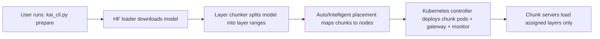
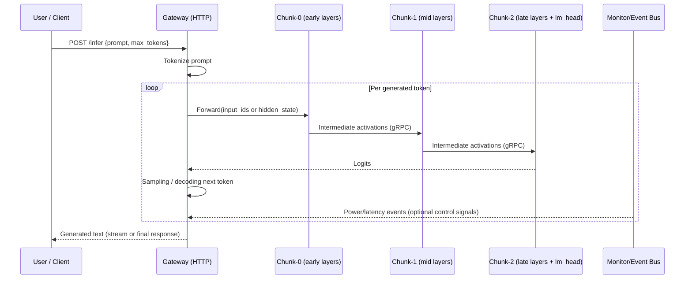

# KAI — Multi-Node Setup Guide

How to connect two (or more) physical machines to run KAI distributed inference.

---

## Prerequisites on ALL Machines

| Requirement | Details |
|---|---|
| OS | Windows (with WSL2) or Linux |
| NVIDIA GPU | Any NVIDIA GPU with drivers installed |
| Python 3.11+ | Required for KAI CLI |
| Docker + NVIDIA Container Toolkit | Required to build and run KAI images |
| Same local network | All machines must be on the same LAN (Wi-Fi or Ethernet) |

---

## Step 1: Set Up a Kubernetes Cluster

Both machines need to be in the same Kubernetes cluster. **K3s** is recommended — it's lightweight and easy to install.

### Option A: K3s on Linux / WSL2 (Recommended)

**On your main machine (control plane):**
```bash
curl -sfL https://get.k3s.io | sh -

# Get the join token:
sudo cat /var/lib/rancher/k3s/server/node-token

# Get your machine's LAN IP:
ip addr show  # e.g., 192.168.1.100
```

**On the second machine (worker node):**
```bash
curl -sfL https://get.k3s.io | K3S_URL=https://192.168.1.100:6443 K3S_TOKEN=<token-from-above> sh -
```

**Verify the cluster:**
```bash
kubectl get nodes
# NAME              STATUS   ROLES    AGE   VERSION
# your-desktop      Ready    master   5m    v1.28
# friends-laptop    Ready    worker   1m    v1.28
```

### Option B: Windows with WSL2

If both machines run Windows, install WSL2 on each, then follow the Linux steps above inside WSL2:

```powershell
# On each Windows machine:
wsl --install -d Ubuntu-22.04
```

Then open the Ubuntu terminal and follow Option A.

---

## Step 2: Install NVIDIA GPU Support in Kubernetes

```bash
# Deploy the NVIDIA device plugin (run on control plane):
kubectl apply -f https://raw.githubusercontent.com/NVIDIA/k8s-device-plugin/v0.14.1/nvidia-device-plugin.yml

# Verify GPUs are visible on each node:
kubectl describe node your-desktop | grep nvidia.com/gpu
kubectl describe node friends-laptop | grep nvidia.com/gpu
```

---

## Step 3: Build Docker Images

```bash
# On the machine where KAI code lives:
cd C:\CODE\KAI
python kai_cli.py build --tag kai:latest

# This builds 3 images:
#   kai-chunk:latest     — Model chunk server (CUDA + PyTorch + gRPC)
#   kai-gateway:latest   — HTTP gateway that chains chunks together
#   kai-monitor:latest   — GPU/CPU monitoring service
```

**Make images available on ALL nodes** (pick one option):

```bash
# Option A: Save and copy via SSH
docker save kai-chunk:latest | ssh user@192.168.1.105 'docker load'
docker save kai-gateway:latest | ssh user@192.168.1.105 'docker load'
docker save kai-monitor:latest | ssh user@192.168.1.105 'docker load'

# Option B: Push to a shared registry
docker tag kai-chunk:latest your-registry.com/kai-chunk:latest
docker push your-registry.com/kai-chunk:latest
# Repeat for gateway and monitor images
```

---

## Step 4: Prepare Model Weights

```bash
# Split the model into chunks (one per node):
python kai_cli.py prepare --model microsoft/phi-2 --num-chunks 2

# For reduced memory usage, add quantization:
python kai_cli.py prepare --model microsoft/phi-2 --num-chunks 2 --quantize 4bit
```

This downloads the HuggingFace model and saves per-chunk weight files. These files need to be accessible to the Kubernetes pods on each node (via volume mounts or shared storage).

---

## Step 5: Deploy to the Cluster

```bash
# Deploy 2 chunks across the cluster:
python -m kubernetes.controller deploy --num-chunks 2 --model transformer

# Verify pods are spread across nodes:
kubectl get pods -n kai -o wide
# NAME             READY   STATUS    NODE
# kai-chunk-0-xx   1/1     Running   your-desktop
# kai-chunk-1-xx   1/1     Running   friends-laptop
# kai-gateway-xx   1/1     Running   your-desktop
```

Kubernetes pod anti-affinity rules prefer placing each chunk on a different node.

---

## Step 6: Run Inference

```bash
# Send a request through the gateway:
curl -X POST http://192.168.1.100:30080/infer \
  -H "Content-Type: application/json" \
  -d '{"prompt": "The capital of France is"}'

# Check cluster health:
curl http://192.168.1.100:30080/health

# View the current chunk topology:
curl http://192.168.1.100:30080/topology
```

---

## Step 7: Enable Energy-Aware Features (Optional)

### High-Frequency Sampling

For detailed power analysis, enable sub-second GPU monitoring:

```bash
# Deploy monitors with 100ms sampling and power threshold alerts:
python -m kubernetes.controller deploy_monitor \
  --sampling-rate 0.1 \
  --enable-threshold \
  --tdp-watts 0   # 0 = auto-detect from GPU

# Query current power threshold status:
curl http://<monitor-ip>:9090/metrics/threshold

# View recent threshold events:
curl http://<monitor-ip>:9090/metrics/events?n=50
```

### Dynamic Energy-Aware Scheduling (DEAS)

DEAS automatically migrates model chunks away from overheating nodes:

```bash
# Run benchmark with DEAS enabled:
python kai_cli.py benchmark --hf-model sshleifer/tiny-gpt2 --mode kubernetes \
  --sampling-rate 0.1 --enable-deas --deas-cooldown 30.0
```

When DEAS detects a node drawing >= 80% of its GPU TDP, it:
1. **Pauses** the chunk on the hot node
2. **Checkpoints** weights + hidden state to disk
3. **Migrates** the checkpoint to a cooler node
4. **Relinks** the gateway to point at the new node
5. **Resumes** inference on the new node

### CPU/Disk Offloading

For models that exceed your cluster's total GPU VRAM:

```bash
# Run with offloading — weights spill to RAM and disk:
python kai_cli.py run --model microsoft/phi-2 --prompt "Hello" --max-tokens 50 \
  --offload --gpu-budget-mb 3000 --disk-swap-dir /tmp/kai_swap
```

---

## Architecture: What's Happening

```
Your Desktop (192.168.1.100)          Friend's Laptop (192.168.1.105)
+---------------------------+        +----------------------------+
|  Gateway (:30080)         |        |                            |
|    |   /topology          |        |                            |
|    |   /relink            |        |                            |
|  Chunk-0 (:50051)        |--gRPC->|  Chunk-1 (:50051)          |
|  [Layers 0-15]           |        |  [Layers 16-31]            |
|  [embed, transformer]    |<-gRPC--|  [transformer, lm_head]    |
|                           |        |                            |
|  Monitor (:9090)         |        |  Monitor (:9090)           |
|  [Power thresholds]      |        |  [Power thresholds]        |
+---------------------------+        +----------------------------+
       ~60W                                  ~60W
                    Total: ~120W
            (vs. single RTX 4090 at 350-450W)
```

**Flow per token:**
1. User sends prompt to Gateway (HTTP POST to `:30080`)
2. Gateway tokenizes and creates input tensor
3. Gateway sends tensor to Chunk-0 via gRPC (`:50051`)
4. Chunk-0 runs layers 0-15 (embedding + first half of transformer)
5. Chunk-0 sends intermediate tensor to Chunk-1 via gRPC
6. Chunk-1 runs layers 16-31 (second half + LM head)
7. Chunk-1 returns logits to Gateway
8. Gateway samples next token, repeats for autoregressive generation

---

## Network Ports

| Component | Protocol | Port | Access | Purpose |
|-----------|----------|------|--------|---------|
| Chunk Servers | gRPC | 50051 | Internal (ClusterIP) | Model layer inference |
| Gateway | HTTP | 8080 | Internal | Inference endpoint |
| Gateway (external) | HTTP | 30080 | NodePort (external) | User-facing access |
| Gateway /topology | HTTP | 30080 | NodePort (external) | Chunk-to-host mapping |
| Gateway /relink | HTTP | 30080 | NodePort (external) | Live chunk migration |
| Monitor | HTTP | 9090 | Internal | GPU/CPU metrics |
| Monitor /metrics/threshold | HTTP | 9090 | Internal | Power threshold status |
| Monitor /metrics/events | HTTP | 9090 | Internal | Threshold event history |
| K8s API | HTTPS | 6443 | Control plane | Cluster management |

---

## Setup Checklist

- [ ] Both machines on same LAN (can ping each other)
- [ ] NVIDIA GPU + drivers installed on each machine
- [ ] K3s cluster running with all nodes visible (`kubectl get nodes`)
- [ ] NVIDIA device plugin deployed (`kubectl describe node | grep nvidia`)
- [ ] Docker images built and loaded on all nodes
- [ ] Model weights prepared (`kai_cli.py prepare`)
- [ ] Pods running and spread across nodes (`kubectl get pods -n kai -o wide`)
- [ ] Gateway accessible at `<control-plane-ip>:30080`
- [ ] Health check passes (`curl <ip>:30080/health`)

---

## Scaling to More Nodes

Adding a third machine is the same process:

```bash
# On the new machine:
curl -sfL https://get.k3s.io | K3S_URL=https://192.168.1.100:6443 K3S_TOKEN=<token> sh -

# Load Docker images on the new node
# Then redeploy with more chunks:
python kai_cli.py prepare --model microsoft/phi-2 --num-chunks 3
python -m kubernetes.controller deploy --num-chunks 3 --model transformer
```

KAI's auto-partitioner will distribute layers proportionally based on each node's available VRAM/RAM.

---

## Troubleshooting

### Nodes not joining the cluster
```bash
# Check K3s agent logs on the worker:
journalctl -u k3s-agent -f

# Common fixes:
# - Firewall: open port 6443 on the control plane
# - Token: make sure you copied the full token from /var/lib/rancher/k3s/server/node-token
# - IP: use the LAN IP, not localhost
```

### GPUs not detected in Kubernetes
```bash
# Check if nvidia-container-toolkit is installed:
nvidia-smi  # Should show your GPU

# Check device plugin pods:
kubectl get pods -n kube-system | grep nvidia

# Restart the device plugin:
kubectl delete pod -n kube-system -l app=nvidia-device-plugin-ds
```

### Pods stuck in Pending
```bash
# Check why:
kubectl describe pod <pod-name> -n kai

# Common causes:
# - Insufficient GPU resources (check requests in deployment YAML)
# - Image not found on node (load images on all nodes)
# - Node affinity preventing scheduling
```

### Gateway can't reach chunks
```bash
# Check chunk service DNS:
kubectl get svc -n kai

# Test from inside the cluster:
kubectl run test --rm -it --image=busybox -- nslookup kai-chunk-0.kai.svc.cluster.local

# Check gRPC connectivity:
kubectl logs -n kai deployment/kai-gateway
```

### High latency between chunks
- Use **wired Ethernet** instead of Wi-Fi for lower latency
- Check network bandwidth: `iperf3 -s` on one machine, `iperf3 -c <ip>` on the other
- Consider enabling gRPC compression in gateway settings
- Reduce chunk count to minimize network round-trips
- **Use intelligent placement** (Phase 24): `python kai_cli.py placement --model <model> --objective latency`

---

## Next-Generation Features for Multi-Node Deployments

KAI includes advanced features specifically designed for multi-node deployments:

### Intelligent Model Placement
Automatically optimizes layer-to-node mapping based on network topology:
```bash
# Generate optimal placement plan considering network latency
python kai_cli.py placement --model microsoft/phi-2 --objective latency --output placement.json

# Or optimize for energy efficiency
python kai_cli.py placement --model microsoft/phi-2 --objective energy
```

### Network-Aware Scheduling
Enhanced DEAS that considers inter-node latency and bandwidth:
- Groups dependent layers on well-connected nodes
- Avoids placing consecutive layers on high-latency links
- Monitors network performance in real-time

### Hybrid Parallelism
For multi-GPU nodes, combine tensor and pipeline parallelism:
```bash
# Auto-detect optimal parallelism mode
python kai_cli.py hybrid --model microsoft/phi-2 --prompt "Hello" --mode auto

# Force tensor parallelism across GPUs on the same node
python kai_cli.py hybrid --model microsoft/phi-2 --prompt "Hello" --mode tensor --tensor-parallel 2
```

### Fault-Tolerant Pipeline
Automatically recovers from node failures:
```bash
# Run with automatic failure detection and recovery
python kai_cli.py fault-tolerant --model sshleifer/tiny-gpt2 --prompt "Hello" \
  --checkpoint-interval 5 --health-interval 5.0
```

### Speculative Decoding
Faster inference with mathematically identical output:
```bash
# Use draft model to speed up inference
python kai_cli.py speculative --model microsoft/phi-2 --prompt "Hello" \
  --speculation-length 5 --verification strict
```

### Auto-Tuning
Find optimal configuration for your cluster:
```bash
# Auto-tune for energy efficiency
python kai_cli.py autotune --model sshleifer/tiny-gpt2 --objective energy --max-trials 20

# Auto-tune for minimum latency
python kai_cli.py autotune --model sshleifer/tiny-gpt2 --objective latency --strategy bayesian
```

### Energy Feedback Control
Closed-loop optimization for power-constrained deployments:
```bash
# Start energy feedback controller
python kai_cli.py energy-loop --power-target 100 --latency-target 50 --daemon
```

---

## Advanced Algorithm Features for Multi-Node (Phase 25)

### FCIM Worker Selection
Fair and cost-efficient worker selection across your cluster:
```bash
# Analyze worker fairness and efficiency
python kai_cli.py fcim --report

# Configure fairness weights
python kai_cli.py fcim --fairness-weight 0.4 --efficiency-weight 0.4 --cost-weight 0.2
```

### ADSA Adaptive Scheduling
Dynamic task scheduling optimized for multi-node workloads:
```bash
# Use adaptive scheduling policy
python kai_cli.py adsa --policy adaptive --show-metrics

# Enable task aging to prevent starvation
python kai_cli.py adsa --policy sjf --enable-aging --aging-rate 0.1
```

### Batch Processing
Process multiple requests together for improved throughput:
```bash
# Enable adaptive batching
python kai_cli.py batch --strategy adaptive --max-batch-size 16

# Enable continuous batching for streaming workloads
python kai_cli.py batch --strategy continuous --timeout-ms 100
```

### ILP/Heuristic Scheduler
Optimal task-to-node allocation:
```bash
# Auto-select algorithm based on problem size
python kai_cli.py ilp-scheduler --algorithm auto --num-tasks 20

# Force ILP for small clusters
python kai_cli.py ilp-scheduler --algorithm ilp --time-limit 60

# Use genetic algorithm for large-scale deployments
python kai_cli.py ilp-scheduler --algorithm genetic --population-size 100
```

### DFS Scheduler with Pruning
Explore scheduling space with intelligent pruning:
```bash
# Use branch-and-bound pruning
python kai_cli.py dfs-scheduler --pruning bound --max-depth 10

# Use beam search for faster results
python kai_cli.py dfs-scheduler --pruning beam --beam-width 5
```

### Simulation Optimization
Test configurations without actual deployment:
```bash
# Run optimized simulation
python kai_cli.py simulate --model sshleifer/tiny-gpt2 --optimization-level 2

# Enable decode approximation for faster simulation
python kai_cli.py simulate --model sshleifer/tiny-gpt2 --approximate-decode --sample-rate 0.1
```

### ONNX Export for Cross-Platform Testing
Export models for testing across different hardware:
```bash
# Export to ONNX with optimization
python kai_cli.py onnx --model sshleifer/tiny-gpt2 --output model.onnx --optimize

# Export with quantization
python kai_cli.py onnx --model sshleifer/tiny-gpt2 --output model_int8.onnx --quantize
```

---

## End-to-End Visualization: How a Model Runs Through KAI

### 1) Deployment-Time Flow (one-time setup)



### 2) Inference-Time Flow (per request)



### 3) Runtime Optimization Overlay (what runs alongside inference)

```text
┌─────────────────────────────────────────────────────────────────────┐
│                    Runtime Control & Optimization                   │
├─────────────────────────────────────────────────────────────────────┤
│ FCIM      -> picks best worker/chunk placement candidate           │
│ ADSA      -> reorders task queue by arrival/size/priority          │
│ DEAS      -> reacts to power thresholds and triggers migration      │
│ Net-aware -> avoids high-latency consecutive layer placements      │
│ KV cache  -> keeps recent tokens FP16, older history compressed    │
│ Batching  -> groups requests for better throughput                 │
│ Feedback  -> tunes batch/power/precision/offload in closed loop    │
│ Fault-Tol -> checkpoint, reassign, and resume on node failure      │
└─────────────────────────────────────────────────────────────────────┘
```

### 4) Quick Mental Model

```text
Prompt -> Gateway -> Chunk-0 -> Chunk-1 -> Chunk-2 -> Logits -> Next token
                          ^          ^          ^
                    monitored + scheduled + optimized continuously
```

---

## Implementation Status - 2026-04-11

### Multi-Node Relevance
- The setup flow in this guide remains valid for distributed chunk deployment and gateway routing.
- Dashboard and telemetry updates now improve observability once the cluster is running.
- DEAS, monitoring, and migration-related endpoints documented here align with implemented runtime paths.

### Practical Runtime Notes
- Use CUDA-capable .venv310 on operator machines when running dashboard-led validation.
- If a node lacks NVML access, telemetry gracefully falls back to nvidia-smi where available.
- KV analytics and inference history are session-driven and useful for validating multi-node behavior over repeated prompts.

### Reader Note
- This multi-node guide is aligned to the currently implemented operational tooling as of 2026-04-11.